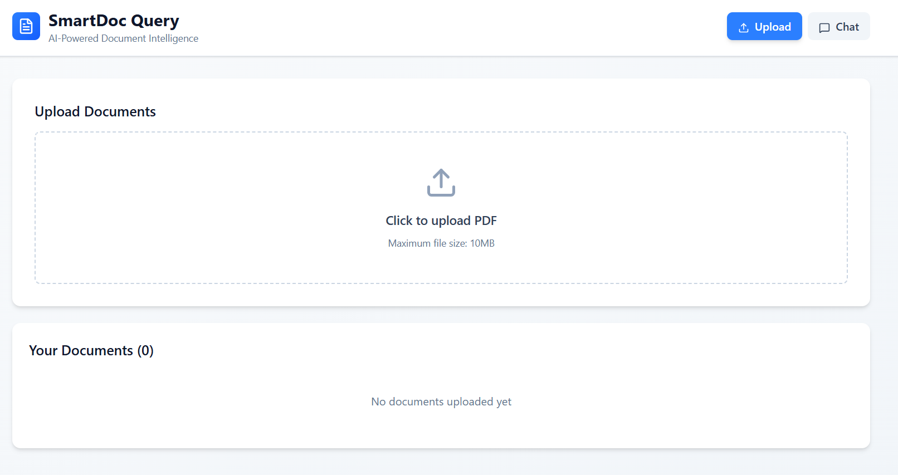
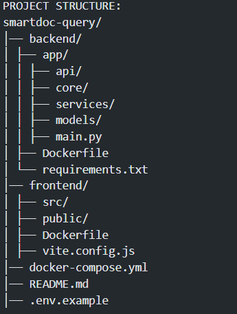

SmartDoc Query System
AI-Powered Document Intelligence Platform

Upload documents → Extract text → Chunk → Embed → Store → Query with AI.

SmartDoc Query is an end-to-end intelligent document processing system built using:

->FastAPI (backend API)

->React + Vite (frontend UI)

->PostgreSQL + pgvector (semantic storage for embeddings)

->Redis (caching + rate limiting)

->OpenAI embeddings (text embedding generation)

->Docker Compose (full app orchestration)

                         ┌───────────────────────┐
                         │        Frontend       │
                         │   React + Vite (5173) │
                         └───────────┬───────────┘
                                     │ REST API
                                     ▼
                     ┌────────────────────────────────┐
                     │           FastAPI API           │
                     │        (Backend Service)        │
                     │  /upload  /query  /documents    │
                     └───────────┬───────────┬────────┘
                                 │           │
                      Redis Cache│           │PostgreSQL + pgvector
                                 ▼           ▼
                    ┌────────────────┐   ┌───────────────────┐
                    │ Redis (6379)   │   │ Postgres (5433)   │
                    │ Rate limiting  │   │ Stores embeddings │
                    │ Embedding cache│   │ Semantic search   │
                    └────────────────┘   └───────────────────┘

